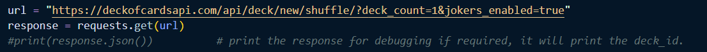
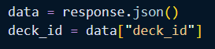
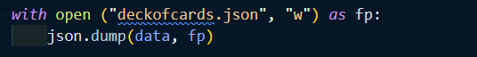
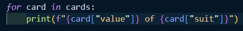
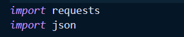
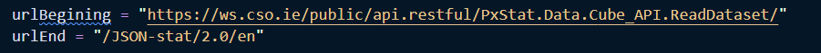
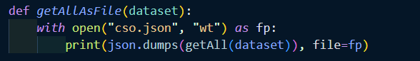
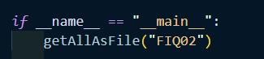

# wsaa-assignments
wsaa-assignments

# Web Services and Applications Assignments Repository

**By Sharon Curley (G00438863@atu.ie)**

    

###### [Image from MilesWeb.com](https://www.milesweb.com/blog/hosting/emerging-web-hosting-technology-trends/)

This repository contains my assignments submission for the module Web Services and Applications.
My github repository link is as follows:

[SBCURLEY/wsaa-assignments](https://github.com/SBCURLEY/wsaa-assignments)

## Installation
I had to install the below to get started on this repository
- Python 
- Visual Studio Code
- Cmder
- Jupyter notebook
- github

## Usage
Once the above is installed is complete, you can run the programs or notebooks

## Dependencies
The following libraries are required to execute my notebook:
- `import requests`: The requests module allows you to send HTTP requests using Python. The HTTP request returns a Response Object with all the response data (content, encoding, status, etc).
- `import json`: JSON is a syntax for storing and exchanging data. It is text, written with JavaScript object notation.
- `matplotlib.pyplot`: Essential for creating static, animated, and interactive visualizations in Python. It is closely integrated with NumPy and provides a MATLAB-like interface for creating plots and visualizations.
- `numpy`: It contains functionality for multidimensional arrays, high-level mathematical functions such as linear algebra operations.
- `pandas`: Fundamental data analysis and manipulation library built on top of the Python programming language. It offers data structures and operations for manipulating numerical tables and time series.
- `seaborn`: Seaborn is a Python data visualization library based on matplotlib. It provides a high-level interface for drawing attractive and informative statistical graphics.
- `datetime`: The datetime is a built-in module that provides classes for manipulating dates and times.
- `re` This module is used to perform pattern matching and substitution on strings with regular expressions.

Using python, import the following as per notebook

`import requests`

`import json`

`import matplotlib.pyplot as plt`

`import numpy as np`

`import pandas as pd`

`import seaborn as sns`

## Repository Structure

### **1. images**

This folder contains all the images used in the README & Assignments.

### **2. gitignore**

This gitignore file specifies intentionally untracked files that Git should ignore.

### **3. README**

This file serves as the first point of contact for users and developers who want to understand the purpose, setup, and usage of my repository.

### **4. assignment2-carddraw.py**

    

###### [Image from Deckofcardsapi.com](https://deckofcardsapi.com/static/img/back.png)

This program uses a Deck of Cards API. It provides an easy way to interact with a virtual deck of playing cards. One can create decks, draw cards, shuffle decks,  etc. For this assignment I had to write a program that shuffles the deck and "deals" (prints out) the value and the suit of 5 cards.
   
#### Program Steps

Firstly, I create and shuffle a new deck of cards using the "Deck of Cards" API. I request the data from the API. I included `jokers_enabled=true` to include jokers when creating the deck, just for fun. By default, jokers are not included. I can print the response for debugging if required, it will print the deck_id too. This is useful for me to check the response for any errors but I have commented it out.

The `response.json` turns the API's answer into a dictionary. The decks unique ID is retrieved as it is required further down in the program

This code opens a file called `deckofcards.json`and writes the data into it and saves it as a file using the `json.dump`.

Using the second URL in the exercise brief, I tell the API to draw 5 cards from the deck using the `deck_id`. The `requests.get(url)` asks the API to draw the five cards. I can print the response for debugging if required, it will print the deck_id too. This is useful for me to check the response for any errors but I have commented it out for now.

The JSON response contains a list of the drawn cards. This code gets the list of cards from the response.

This code goes through each card in the list and prints its value and suit.

#### Executable command
- $ python .\assignment2-carddraw.py

#### Sample Output
deckofcards.json

- 5 of SPADES
- JOKER of RED
- 4 of HEARTS
- 5 of HEARTS
- JACK of CLUBS

#### References
- Topic 2 Datastructure Lecture - I referenced the wsaa2.4-readfromcloud.py which uses the Coindesk API
- Lab 2 Trains - this lab was a great resource
- w3schools: https://www.w3schools.com/python/python_json.asp    Introduction to JSON. There is a very useful reference and examples for when you convert from Python to JSON, Python objects are converted into the JSON (JavaScript) equivalent. 
- w3schools: https://www.w3schools.com/python/module_requests.asp    Introduction to the Request library
- RealPython: https://realpython.com/python-requests/   This resource details the Get request and the Response with examples.
- Deck of Cards API: https://deckofcardsapi.com/    Source for this program, his is also where I found how to include jokers, just for fun. 
- Public API: https://publicapi.dev/deck-of-cards-api  This resource offers more insight into the Deck of Cards API. Users can create decks, draw cards, shuffle decks, and more through a set of RESTful API endpoints.

### **5.assignment03-cso.py.**

    

###### [Image from Jefferson Payroll ](https://www.jeffersonpayroll.ie/structure-of-earnings-survey-ireland/)

This program retrieves the dataset for the "exchequer account (historical series)" from the Central Statistics Office (CSO) of Ireland's API, and stores it into a file called "cso.json". The data is located at [www.cso.ie](https://www.cso.ie/en/index.html)- Economy - Finance - Financial Indicators. Its code is FIQ02. The dataset can be replaced with other dataset codes to retrieve different datasets.

#### Program Steps

Firstly, I import the required libraries. `requests` is used to send HTTP requests to the API and `json` handles JSON data

I define the url beginning and end, so that I can reuse this code for various data in the Central Statistics Office (CSO) of Ireland's API

This function gets the API URL using a dataset name (which I can define later). I then send a GET request to fetch the dataset, and return a response.

This function gets the data and saves it in JSON file called `cso.json`

I run the script calling the dataset FIQ02 directly.

#### Executable command
- $ python .\assignment03-cso.py

#### Sample Output
cso.json

#### References
- Topic 4  Reading API's in the Wild lecture:  I referenced the video on csodao.py.
- github: https://github.com/virtualarchitectures/CSO_Ireland_JSONStat4Py    this repository contains a Jupyter notebook demonstrating how to access the Statbank API for Central Statistics Office (CSO) Ireland.

### **6. **
   
   This program simulates 

   The assignment is divided into the following sections

### **7. **

### References

#### Please note References are shared within each assignment notebook for context. 

- w3schools: Pandas cleaning empty cells  https://www.w3schools.com/python/pandas/pandas_cleaning_empty_cells.asp
- Machine Learning Tutorials: pandas to_numeric Tutorial (With Examples)       https://machinelearningtutorials.org/pandas-to_numeric-tutorial-with-examples/
- Pandas Pydata: pandas.to_numeric     https://pandas.pydata.org/pandas-docs/version/2.0/reference/api/pandas.to_numeric.html

## About Author
- Sharon Curley
  
    My role is a Business Systems Analyst for [Meissner Corporation](https://www.meissner.com/) - a manufacturing company in Castlebar, Co. Mayo. The systems I am supporting currently are Microsoft Dynamics 365 (ERP) for all Meissner entities (Ireland, US, Switzerland, Germany & Italy). I initially started out in functional areas - Customer Service & Supply Chain as I was lucky to be one of the first crew members on board in this company in 2020. I have moved into the IT Dept since March 2023. I have a background in SAP - projects & support, so was drawn back into this area when I saw the opportunity arise within Meissner. I have a keen interest in data as when I was a functional user that was the most challenging part of my role - trying to get meaningful data from the systems we use. I have used excel to an advanced level and started with Power BI. I see a lot of opportunities within Meissner to develop in the Data field. I am hoping I will have the skills to do so.

- [Git Hub Profile](https://github.com/SBCURLEY "Sharon Curley")

- [Email](mailto:G00438863@atu.ie?subject=Hi "Hi!")

